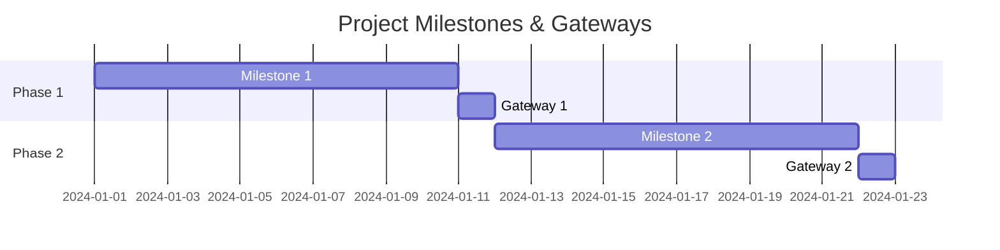

# Milestones & Gateways Document Template

This markdown file is a template for documenting project milestones and gateways, including use cases, in both Mermaid and Markdown formats.

## Instructions
- Identify big milestones from project Phases (see docs/bc.md).
- Split big milestones into smaller milestones if possible.
- For each milestone/gateway, define use cases.
- Reference docs/furps.md for quality attributes and docs/kpi.md for KPIs.

## Mermaid Gantt Example

## Markdown Table Example
| Milestone/Gateway | Description | Use Cases | Entry Criteria | Exit Criteria |
|-------------------|-------------|-----------|---------------|---------------|
| Milestone 1       | ...         | ...       | ...           | ...           |
| Gateway 1         | ...         | ...       | ...           | ...           |

---
Update this file as you define new milestones/gateways and use cases.
