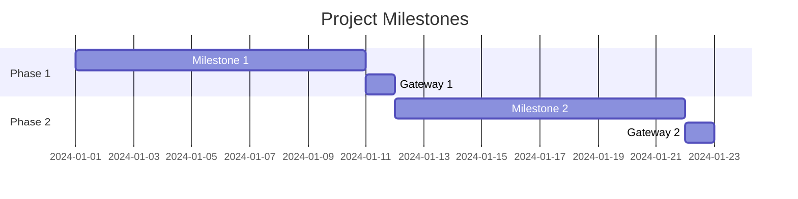

# Milestones & Gateways Documentation Instructions

This file provides templates and instructions for documenting project milestones and gateways using Mermaid diagrams and Markdown.

## How to Use
1. Review the business case (docs/bc.md) and identify project Phases as big milestones.
2. If a big milestone can be split, define smaller milestones.
3. For each milestone/gateway, define:
   - Name
   - Description
   - Entry/Exit Criteria
   - Associated Use Cases
   - Quality Criteria (see qc-milestones-gateways.md)
   - KPIs (see docs/kpi.md)
4. Visualize the milestones/gateways using Mermaid Gantt or flow diagrams.
5. Reference docs/furps.md for quality attributes.

## Mermaid Example

## Markdown Table Example
| Milestone/Gateway | Description | Entry Criteria | Exit Criteria | Use Cases |
|-------------------|-------------|---------------|---------------|-----------|
| Milestone 1       | ...         | ...           | ...           | ...       |
| Gateway 1         | ...         | ...           | ...           | ...       |

---
Update this file as you define new milestones/gateways.
