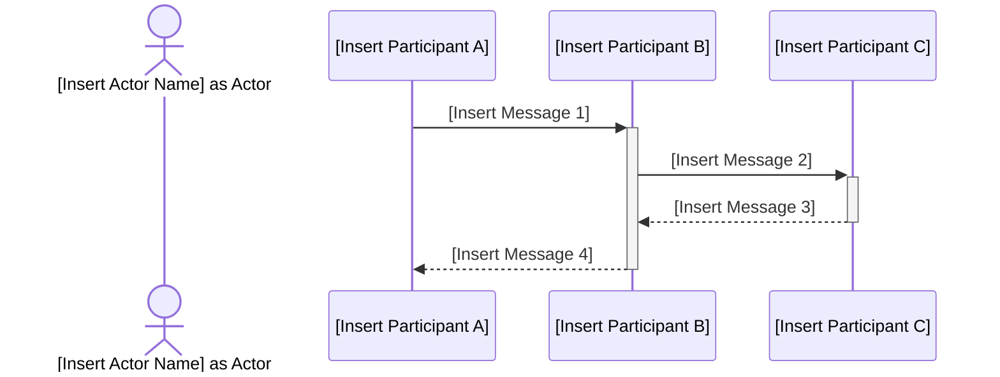

# Sequence Diagram (SD) Instructions

This instruction file provides a template and quality criteria for documenting Sequence Diagrams (SD) in markdown format using Mermaid syntax.
Use this as a starting point for any project requiring a Sequence Diagram.
Replace all placeholders in the template with project-specific content.

## General Instructions

- Use this template for all Sequence Diagram documentation in markdown format.
- Replace all bracketed placeholders in the Mermaid diagram and Markdown with project-specific information.
- Store Sequence Diagram files in the centralized repository.
- Review and approve Sequence Diagrams with relevant stakeholders before acceptance.

## Best Practices

- Clearly define all relevant participants and interactions.
- Use clear, concise, and process-oriented language.
- Document all assumptions and dependencies.
- Ensure visuals and layout are consistent and easy to understand.
- Use valid Mermaid sequence diagram syntax.

## Code Standards

- Each Sequence Diagram must have a unique version identifier and a documented change log.
- Use the provided Mermaid diagram layout for consistency.
- Each participant lifecycle should be clearly defined.

### File Naming
- Name files in lowercase, using digits for version,
  - following the file name pattern: `uc-xxx.sd.xxxx.md` (e.g., `uc-xxx.sd.0001.md`).
    - add use case identifier as prefix for filename.
    - save files in a subfolder named after the use case (e.g., `docs/use-cases/uc-xxx/uc-xxx.sd.0001.md`).
- Increment version numbers for significant changes.
- Include the todays date and author in the version log.
- We only keep the latest version in the main branch; delete older versions or archive them in a designated folder `archive`.

## Common Patterns

Properly we have a WebUI, but we can also have other participants in the sequence diagram, such as backend services, databases, external APIs, or other system components.

Backend participants could be an IService, IRepository, Controller, or any other relevant role or system component.

Actor can be used to represent a user or external system that interacts with the system being modeled. For example, in a sequence diagram for a web application, an actor could represent a user who interacts with the WebUI.
- As for interactions, we can use description without methods.

Participants interactoins can be represented as messages between participants, and we can use the following guidelines for message descriptions:
- Use methods names with parameters as message descriptions to clearly indicate the interactions between participants.
- For paramters, use a simplified format (e.g., `methodName(param1, param2)`) to maintain clarity while conveying the necessary information about the interactions. See solutions dm.xxxx.md for examples of how to format messages with parameters in the sequence diagram.

Make a note if we need DTO or not, and if we need to transform data between layers (e.g., from WebUI to Service layer) and example of how the data transformation should be done.

### Good Example
```markdown
# [Insert Sequence Diagram Title]

## Metadata

| Key               | Value                             |
|-------------------|-----------------------------------|
| Id                | SD-[Insert Unique Identifier]     |
| crossReference    | [Insert SSD Reference] or [Insert OC Reference] |

## Version Log

| Version | Date       | Description              | Author     |
|---------|------------|--------------------------|------------|
| 0001    | [yyyy-mm-dd] | Initial                  | [Author Name] |

## Sequence Diagram
```



```
**Note:** While Strict UML purists argue that actor is not part of sequence diagram, we can use actor in sequence diagram if it helps to clarify the interactions and roles of different participants in the system. The key is to ensure that the diagram remains clear and easy to understand for all stakeholders even it breaks strict UML rules.

---

**Note on DTOs and Data Transformation:**
[Insert any notes regarding the need for Data Transfer Objects (DTOs) or data transformation between layers, if applicable. Provide examples of how data should be transformed if necessary.]

[Show class example if needed, e.g., for a DTO or data transformation]
```

### Bad Example
```
sequenceDiagram
    [Participant 1] -> [Participant 2]: [Message]
    [Participant 2] -> [Participant 3]: [Message]
```

## Validation

- Review Sequence Diagrams for completeness, clarity, and correct use of the Mermaid template.
- Verify that all placeholders are replaced with project-specific content.
- Ensure Mermaid syntax is valid and renders correctly.

## Maintenance

- Update the version and change log for major changes.
- Regularly review Sequence Diagrams for accuracy and relevance.

## Language 

- Professional
- English

## System object

if object chenges name form artifacts before then make / update glosery `/docs/glosery.md` with class name in artifacts we transform from and class name in this artifacts.
