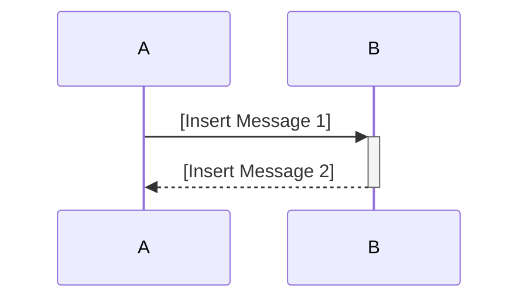
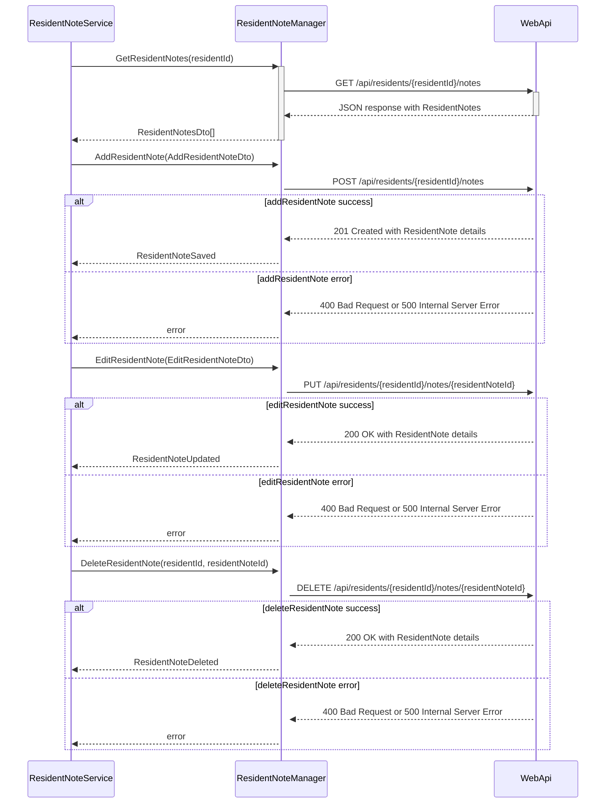
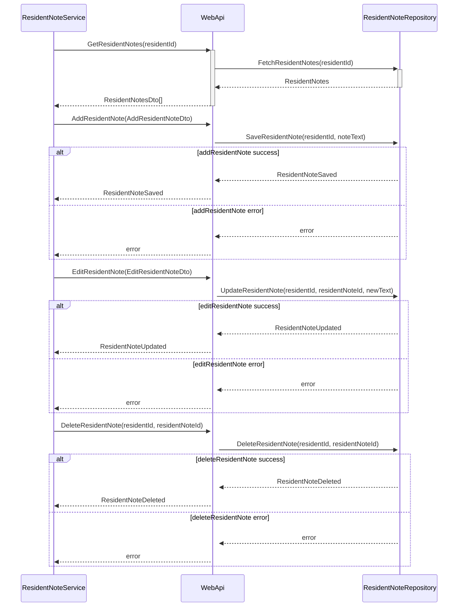
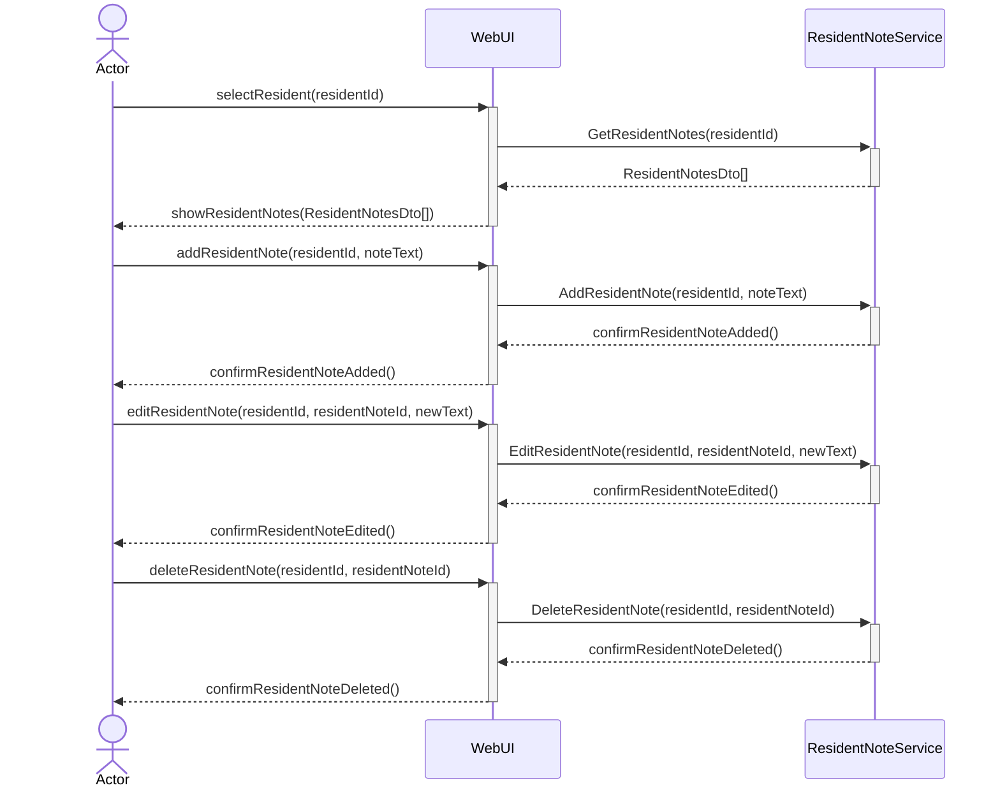

# SD Instructions (Summary)
- Use the provided SD markdown template or examples.
- Replace all placeholders with project-specific content.
- Store SD files in `docs/use-cases/uc-<Insert Use Case Identifier>*/` as `uc-<Insert Use Case Identifier>.sd.md`.
- Increment version numbers for significant changes.
- Include metadata, version log (with date, author), and use Mermaid sequence diagram.
- Create files in English; if product owner domain language differs, create a separate file with language code suffix.
- Update glossary files for new terms.
- Validate SDs for completeness, clarity, and template compliance.


## SD Template (Minimal):
```markdown
# [Insert Sequence Diagram Title]


## Metadata
| Key            | Value           |
|----------------|-----------------|
| Id             | [Use case].SD   |
| crossReference | [Use case].SSD [Use case].OC   |

## Version Log
| Version | Date       | Description | Author |
|---------|------------|-------------|--------|
| 0001    | [date]     | Initial     | <Insert Author Name> |


## Sequence Diagram
### Presentation Layer → Application Layer
```

```mermaid
sequenceDiagram
    actor [Insert Actor Name] as Actor
    participant A
    participant B
    participant C

    Actor->>+A: [Insert Message 1]
    A->>+B: [Insert Message 2]
    B->>+C: [Insert Message 3]
    C-->>-B: [Insert Message 4]
    B-->>-A: [Insert Message 5]
    A-->>-Actor: [Insert Message 6]
    %% Add more interactions as needed
```

```markdown
### Application Layer → Infrastructure Layer (External Interfaces)
```



if there are an WebApi for data access, we can add another sequence diagram for the interactions between Application Layer and Infrastructure Layer (Data Access):

```markdown
### Application Layer → Infrastructure Layer (Data Access)
```


```
**Note:** While Strict UML purists argue that actor is not part of sequence diagram, we can use actor in sequence diagram if it helps to clarify the interactions and roles of different participants in the system. The key is to ensure that the diagram remains clear and easy to understand for all stakeholders even it breaks strict UML rules.

---

**Note on DTOs and Data Transformation:**
[Insert any notes regarding the need for Data Transfer Objects (DTOs) or data transformation between layers, if applicable. Provide examples of how data should be transformed if necessary.]

[Show class example if needed, e.g., for a DTO or data transformation]
```


## SD Example: UC-002 Dashboard ResidentNote

```markdown
# UC-002 Dashboard ResidentNote Sequence Diagram

## Metadata
| Key            | Value           |
|----------------|-----------------|
| Id             | UC-002.SD  |
| crossReference | UC-002.SSD UC-002.OC   |

## Version Log
| Version | Date       | Description | Author |
|---------|------------|-------------|--------|
| 0007    | 2026-06-09 | Change to WebApi→Infrastructure Data Access diagram | <Insert Author Name> |

## Sequence Diagram
```

```markdown
### WebApi Layer → Infrastructure Layer (Data Access)
```




```markdown
### Application Layer → Infrastructure Layer (WebAPI)
```



```markdown
### Presentation Layer → Application Layer
```



---

**Notes:**
- The WebUI never calls the controller or data access directly; it always calls the Application layer (Service/Handler), which orchestrates all business logic and data access.
- Data Transfer Objects (DTOs) are used between layers to decouple UI and domain models.
- Example: `AddResidentNote(residentId, noteText)` in WebUI is transformed into an `AddResidentNoteDto` when sent to the Application layer, which then passes it to the WebApi.
- Data returned from the database is mapped to DTOs before being sent to the WebUI.
- All data transformations are explicit and documented in the implementation.

**DTO Example:**
```csharp
public class AddResidentNoteDto
{
    public Guid Id { get; set; }
    public string ResidentNote { get; set; }
}

