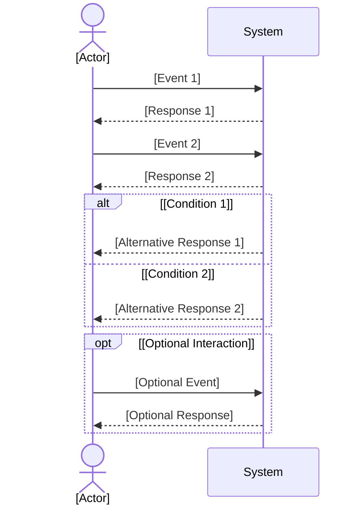
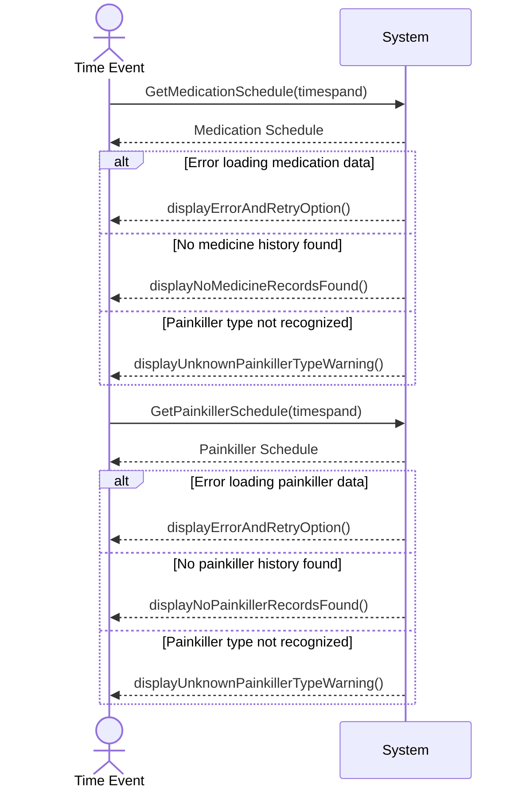

# SSD Instructions (Summary)
- Use the provided SSD markdown template.
- Replace all placeholders with project-specific content.
- Store SSD files in `docs/use-cases/uc-<Insert Use Case Identifier>*/` as `uc-<Insert Use Case Identifier>.ssd.<Insert Version>.md`.
- Increment version numbers for significant changes; keep only the latest version in main, archive older versions.
- Include metadata, version log (with date, author), and use Mermaid sequence diagram.
- Create files in English; if product owner domain language differs, create a separate file with language code suffix.
- Update glossary files for new terms.
- Validate SSDs for completeness, clarity, and template compliance.

## SSD Template (Minimal):
```markdown
## Metadata
| Key            | Value           |
|----------------|-----------------|
| Id             | [Use case].SSD  |
| crossReference | [Use case] [Use case].DM   |

## Version Log
| Version | Date       | Description | Author |
|---------|------------|-------------|--------|
| 0001    | [date]     | Initial     | [name] |

## System Sequence Diagram
```



optional sections for product owner domain language:
```markdown
## Language Translation

| Original Term           | [Language] Translation         |
|------------------------|---------------------------|
| [Original Term 1]      | [Translation 1]            |
| [Original Term 2]      | [Translation 2]            |
```

### SSD Instructions Example:
```markdown
# SSD for Use Case 003:

## Metadata
| Key            | Value           |
|----------------|-----------------|
| Id             | UC-003.SSD      |
| crossReference | UC-003 UC-003.DM |

## System Sequence Diagram
```



optional sections for product owner domain language:
```markdown
## Glossary

| English Term                | Product Owner Term         | Notes |
|-----------------------------|---------------------------|-------|
| TimeEvent                   | Tidsbegivenhed            |       |
| Medicine Status             | Medicinstatus             |       |
| Painkiller                  | Smertestillende           |       |
| MedicineAdministration      | Medicinadministration      |       |
| PainkillerAdministration    | Smertestillendeadministration |   |
| Dashboard                   | Dashboard                 |       |
| Resident                    | Beboer                    |       |
```
