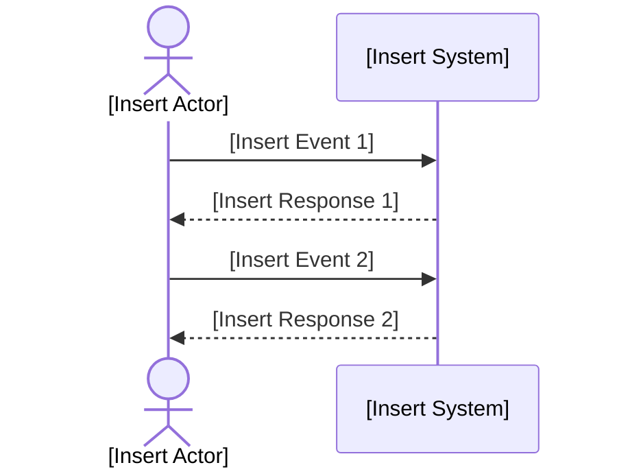

# Quality Criteria: System Sequence Diagram (SSD)
The System Sequence Diagram (SSD) is a visual tool for specifying the sequence of interactions between external actors and the system for a particular use case.
SSDs clarify system boundaries, events, and responses, supporting requirements analysis and design.

## Metadata
| Key               | Value                             |
|-------------------|-----------------------------------|
| Id                | QC-SSD                            |
| crossReference    | Applying UML and patterns by Craig Larman |

### Change Log
| Date       | Version | Description                     | Author        |
|------------|---------|---------------------------------|---------------|
| 2026-02-13 | 0001    | Initial creation of the document | Tirsvad      |
| 2026-03-07 | 0002    | Updated quality criteria and template | Tirsvad |

## Quality Criteria for System Sequence Diagram
When evaluating a System Sequence Diagram, consider the following quality criteria:
1. **Clarity and Simplicity**: The SSD should be easy to interpret, with clear actor role and system boundaries. Use concise event names and avoid unnecessary complexity.
2. **Completeness**: All relevant interactions for the use case must be included, showing each event and system response.
3. **Relevance**: Events and responses should be specific to the use case and system context.
4. **Consistency**: The SSD should align with use case descriptions and other requirements artifacts.
5. **Visual Appeal**: The diagram should be visually organized, using Mermaid syntax for clarity and reproducibility.
6. **Actors**: Actors can be a user role, System time event, and an external system that interacts with the system. Actors should be clearly identified and labeled.

## Common Patterns for SSD Markdown Files

### Filename Convention
- Name files in lowercase, using digits for version,
  - following the file name pattern: `uc-yyy.ssd.xxxx.md` (e.g., `uc-001.ssd.0001.md`).
    - add use case identifier as prefix for filename.
    - save files in a subfolder named after the use case (e.g., `docs/use-cases/uc-001/uc-001.ssd.0001.md`).
  - for translation to Danish, use `uc-yyy.ssd.xxxx.da.md` (e.g., `uc-001.ssd.0001.da.md`).
- Increment version numbers for significant changes.
- Include the todays date and author in the version log.
- we only keep the latest version in the main branch; delete older versions or archive them in a designated folder `archive`.


### Good Example
```markdown
## Metadata
| Key               | Value                             |
|-------------------|-----------------------------------|
| Id                | SSD                               |
| crossReference    | [Use case identifier] [Use case identifier].DM |

## Version Log
| Version | Date       | Description              | Author     |
|---------|------------|--------------------------|------------|
| 0001    | [insert todays date] | Initial                  | [insert author name] |

## System Sequence Diagram
```

### Mermaid SSD Template


## Validation
- Review SSDs for completeness, clarity, and correct use of the template.
- Verify that all placeholders are replaced with project-specific content.

## Maintenance
- Update the version and change log for major changes.
- Regularly review SSDs for accuracy and relevance.

## Language 
- Professional
- English
- If product owner domain language is different, use that language for the diagram content while maintaining English for metadata and versioning. And save the file with a language code suffix (e.g., `uc-001.ssd.0001.da.md` for Danish). 
- Update `/docs/glossary.md` with any new terms introduced in the SSD, providing translations and definitions for each term. Ensure that all placeholders in the SSD template are replaced with project-specific content in both English and product owner domain language if different.
